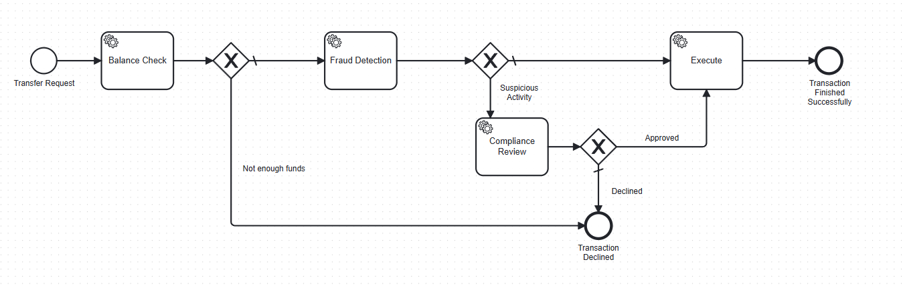

# Workflow

Every transfer runs through a single Camunda 8 BPMN process, orchestrated by
four job workers and one gateway-driven branch for compliance review.

## Process diagram

## Steps

### 1. Balance Check (`balance-check`)

Verifies `fromAccount` has sufficient funds for `amount`. Returns
`sufficientBalance` and `availableBalance` as process variables.

- **Insufficient** → the process ends immediately, skipping fraud detection
  entirely. (Known limitation: this means insufficient-balance attempts
  aren't recorded in `transfer_history`, since that write only happens
  inside fraud detection. Acceptable for a demo; would need an earlier
  audit-log step for anything closer to production.)
- **Sufficient** → continues to Fraud Detection.

### 2. Fraud Detection (`fraud-check`)

Runs a rules-based risk score via `FraudDetectionService`. Every transfer
reaching this step is recorded in `transfer_history` regardless of outcome,
which is also what the velocity rule reads from.

| Rule | Trigger | Score |
|---|---|---|
| Velocity | More than 5 transfers from this account in the last 10 minutes | +40 |
| High amount | Amount ≥ $1,000 | +30 |
| Above account average | Amount ≥ 3× the account's recent average transfer | +20 |
| New payee | First transfer to this recipient, combined with amount ≥ $5,000 | +15 |

A combined score ≥ 50 sets `flagged = true`.

- **Not flagged** → continues directly to Execute.
- **Flagged** → routes to Compliance Review.

### 3. Compliance Review (`compliance-review`) — conditional

Only reached when a transfer is flagged. This is a **job worker with manual
completion** (`autoComplete = false`), not a native Zeebe user task — chosen
so the custom Vue admin panel can drive the decision directly via REST
(`GET /reviews`, `POST /reviews/{jobKey}/decision`) rather than going through
Camunda's built-in Tasklist.

The job is registered in an in-memory `PendingReviewRegistry` when activated,
and stays open on the broker (job timeout set to 24h so Zeebe doesn't
reassign it) until a decision arrives. See [`API.md`](API.md) for the request
shape.

> **Known limitation:** the registry is in-memory only. If `transfer-backend`
> restarts while reviews are pending, those jobs are orphaned from the app's
> perspective (though still alive on the Zeebe broker due to the long
> timeout). Production use would persist `jobKey` + variables to a database
> table instead.

- **Approved** → continues to Execute.
- **Declined** → the process ends as rejected.

### 4. Execute (`execute-transfer`)

Performs the actual balance update — debits `fromAccount`, credits
`toAccount` — inside a single `@Transactional` method
(`AccountService.executeTransfer`). Re-checks sufficiency at this point
rather than trusting the earlier Balance Check result, since time may have
passed (e.g. a compliance review sitting pending) during which the balance
could have changed.

If this step throws (e.g. balance became insufficient in the interim), the
job fails and Zeebe raises an incident — intentional, since a failed balance
update should stop and surface for investigation rather than fail silently.

## Job types summary

| Job type | Worker class | Auto-completes? |
|---|---|---|
| `balance-check` | `BalanceCheckWorker` | Yes |
| `fraud-check` | `FraudCheckWorker` | Yes |
| `compliance-review` | `ComplianceReviewWorker` | No — completed via REST API |
| `execute-transfer` | `TransferExecutionWorker` | Yes |

## Known gaps (not yet implemented)

These were identified during development as reasonable next steps, not
required for the current demo:

- No error boundary events — a thrown exception on any task becomes an
  unresolved Zeebe incident with no defined recovery path in the model.
- No timer boundary on Compliance Review — nothing expires or escalates a
  review that's never actioned (only the 24h job-reassignment timeout exists
  at the infrastructure level).
- Gateway conditions and end events aren't labeled in the BPMN diagram
  itself — outcomes are distinguishable via Operate (variable values, path
  taken) but not visually from the diagram alone.
